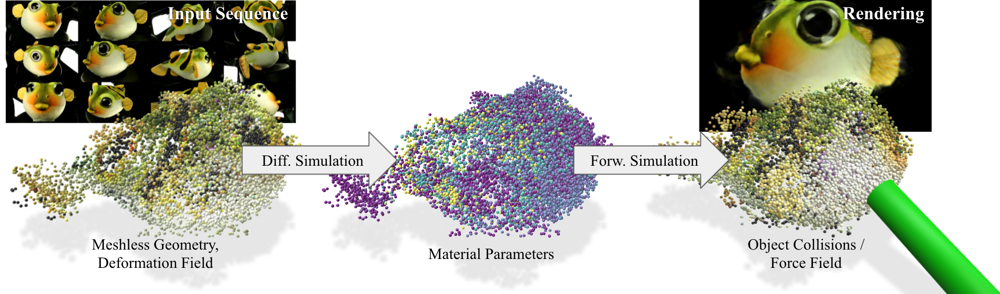

<center> <h1> VEOs: Virtual Elastic Objects </h1> </center>
<center> <h4>Hsiao-yu Chen<sup>1,3</sup>, Edith Tretschk<sup>2,3</sup>, Tuur Stuyck<sup>3</sup>, Petr Kadlecek<sup>3</sup>, Ladislav Kavan<sup>3</sup>, Etienne Vouga<sup>1</sup>, Christoph Lassner<sup>3</sup></h4> </center>
<center> <h4> <sup>1</sup>University of Texas at Austin, <sup>2</sup>Max Planck Institute for Informatics, <sup>3</sup>Meta Reality Labs Research </h4> </center>


We present Virtual Elastic Objects (VEOs): virtual objects that not only look like their real-world counterparts but also behave like them, even when subject to novel interactions. Achieving this presents multiple challenges: not only do objects have to be captured including the physical forces acting on them, then faithfully reconstructed and rendered, but also plausible material parameters found and simulated. To create VEOs, we built a multi-view capture system that captures objects under the influence of a compressed air stream. Building on recent advances in model-free, dynamic Neural Radiance Fields, we reconstruct the objects and corresponding deformation fields. We propose to use a differentiable, particle-based simulator to use these deformation fields to find representative material parameters, which enable us to run new simulations. To render simulated objects, we devise a method for integrating the simulation results with Neural Radiance Fields. The resulting method is applicable to a wide range of scenarios: it can handle objects composed of inhomogeneous material, with very different shapes, and it can simulate interactions with other virtual objects. We present our results using a newly collected dataset of 12 objects under a variety of force fields, which is available in the following link.
  
[[Paper]](https://arxiv.org/abs/2201.04623) [[Dataset]](https://github.com/facebookresearch/plush_dataset.git)

<video width="900" height="500" controls>
  <source src="veos.mp4" type="video/mp4">
</video>

### Bibtex

```
@InProceedings{Chen_VEO,
    author = {Hsiao-yu Chen and Edith Tretschk and Tuur Stuyck and Petr Kadlecek and Ladislav Kavan and Etienne Vouga and Christoph Lassner},
    title  = {Virtual Elastic Objects},
    booktitle = {IEEE/CVF Conference on Computer Vision and Pattern Recognition (CVPR)},
    month = {June},
    year = {2022}
}
```

